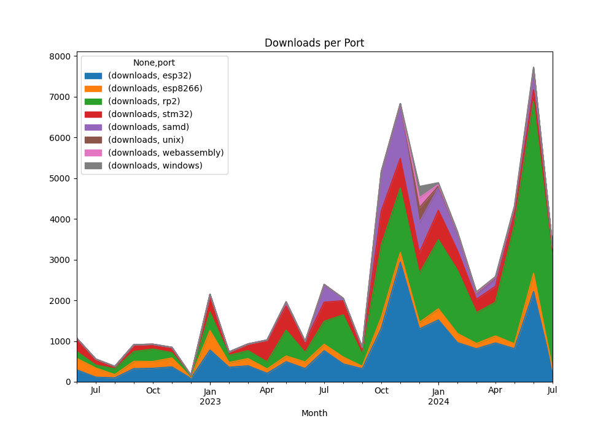
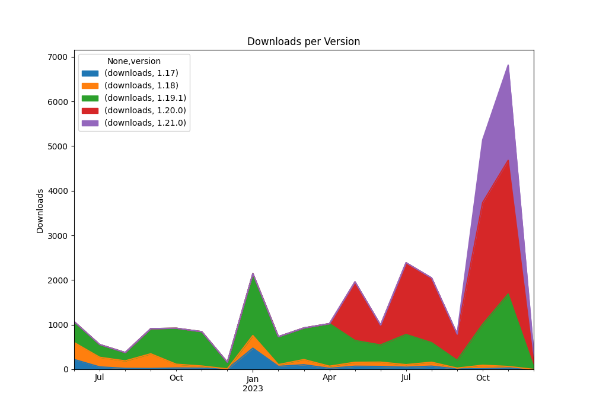
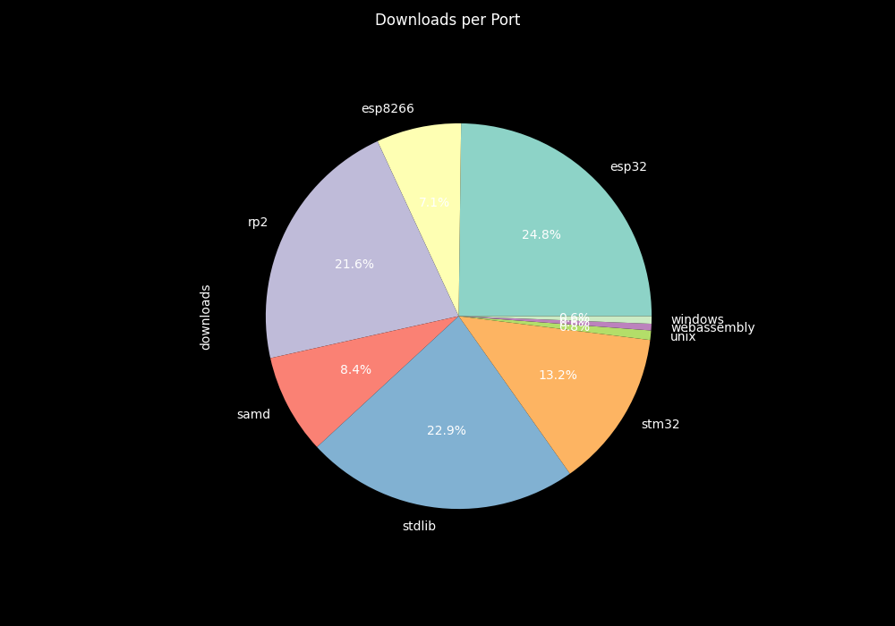

# micropython-stubs

[](https://micropython-stubs.readthedocs.io/en/latest/?badge=latest "Document build status badge")
[](https://github.com/josverl/micropython-stubs/stargazers)
[](#Contributions)
[](https://github.com/python/black "Black badge")
 


This repo stores stubs generated by the [MicroPython-Stubber](https://github.com/Josverl/micropython-stubber#readme) tool.
Currently over 3.000 stubfiles of multiple MicroPython versionas and modules are available to help you : 
- write code quicker
- with less errors,
- get help from  code completion, 
- use static type checking,
- and improve the overall development experience while writing [MicroPython](https://micropython.org/).

The stubs are packaged and published to PyPi as [Pep 561 stub-only](https://peps.python.org/pep-0561/#stub-only-packages) packages to allow them to be installed and used with ease.


**Demo using VSCode:**


## To install
- Install in a typings folder (recommended) 
  `pip install -U micropython-<port>[-<board>]stubs --no-user --target ./typings`
- Install in a venv (after activating) 
  `pip install -U micropython-<port>[-<board>]stubs --no-user`

Examples:
``` bash
pip install -U micropython-stm32-stubs

# Install stubs for a specific version.
pip install -U micropython-esp32-stubs==1.20.0.*

# Install stubs for a specific board.
pip install -U micropython-rp2-pico_w-stubs

# install to a typings folder (for use without a .venv by pyright or pylance)
pip install -U micropython-rp2-stubs --target typings --no-user
```

For more details how to use the stubs please refer to [the documentation on RTD](https://micropython-stubs.readthedocs.io/en/latest/20_using.html)

## Current MicroPython stub packages 

You can search for [Micropython stub packages on PyPI][PYPI]

For a full overview of all stubs check out [the documentation on read the docs](https://micropython-stubs.readthedocs.io/en/latest/firmware_grp.html), or in  [docs/firmware_grp.md](docs/firmware_grp.md)

## Usage statistics

The following graph shows the number of downloads of the stubs from PyPi over time.
Im not sure what causes the spikes in downloads, but it is interesting to see that the number of downloads is increasing over time, and some of the spikes have corrolation to the publication of new MicroPython versions.

In addition some tools such as [the MicroPico VSCode extension](https://marketplace.visualstudio.com/items?itemName=paulober.pico-w-go) bundle a version of the stubs with their tool, so the actual number of users is higher than the number of downloads.

<table>
    <tr>
        <td></td>
        <td> </td>
    </tr>
    <tr>
        <td> </td>
    </tr>
</table>

## Contributors
Thanks to everyone that has submitted stubs or other relevant pieces of code and information, or published relevant stubs on pypi or github.

<!-- ALL-CONTRIBUTORS-LIST:START - Do not remove or modify this section -->
<!-- prettier-ignore-start -->
<!-- markdownlint-disable -->
<table>
  <tbody>
    <tr>
      <td align="center" valign="top" width="14.28%"><a href="https://github.com/Josverl"><br /><sub><b>Jos Verlinde</b></sub></a><br /><a href="https://github.com/Josverl/micropython-stubs/commits?author=josverl" title="Code">💻</a> <a href="#stubs-josverl" title="MicroPython stubs">📝</a> <a href="#test-josverl" title="Test">✔</a> <a href="#tool-josverl" title="Tools">🔧</a></td>
      <td align="center" valign="top" width="14.28%"><a href="https://micropython.org/"><br /><sub><b>MicroPython</b></sub></a><br /><a href="#data-micropython" title="Data">🔣</a> <a href="#stubs-micropython" title="MicroPython stubs">📝</a></td>
      <td align="center" valign="top" width="14.28%"><a href="https://github.com/loboris"><br /><sub><b>Boris Lovosevic</b></sub></a><br /><a href="#data-loboris" title="Data">🔣</a> <a href="#stubs-loboris" title="MicroPython stubs">📝</a></td>
      <td align="center" valign="top" width="14.28%"><a href="https://github.com/pfalcon"><br /><sub><b>Paul Sokolovsky</b></sub></a><br /><a href="#data-pfalcon" title="Data">🔣</a> <a href="#stubs-pfalcon" title="MicroPython stubs">📝</a></td>
      <td align="center" valign="top" width="14.28%"><a href="https://github.com/pycopy"><br /><sub><b>pycopy</b></sub></a><br /><a href="#data-pycopy" title="Data">🔣</a> <a href="#stubs-pycopy" title="MicroPython stubs">📝</a></td>
      <td align="center" valign="top" width="14.28%"><a href="https://github.com/pycom"><br /><sub><b>Pycom</b></sub></a><br /><a href="#infra-pycom" title="Infrastructure (Hosting, Build-Tools, etc)">🚇</a></td>
      <td align="center" valign="top" width="14.28%"><a href="https://github.com/BradenM"><br /><sub><b>Braden Mars</b></sub></a><br /><a href="#stubs-BradenM" title="MicroPython stubs">📝</a> <a href="#test-BradenM" title="Test">✔</a> <a href="#tool-BradenM" title="Tools">🔧</a> <a href="#platform-BradenM" title="Packaging/porting to new platform">📦</a></td>
    </tr>
    <tr>
      <td align="center" valign="top" width="14.28%"><a href="https://github.com/pfalcon"><br /><sub><b>Paul Sokolovsky</b></sub></a><br /><a href="#stubs-pfalcon" title="MicroPython stubs">📝</a></td>
      <td align="center" valign="top" width="14.28%"><a href="https://github.com/dastultz"><br /><sub><b>Daryl Stultz</b></sub></a><br /><a href="#stubs-dastultz" title="MicroPython stubs">📝</a></td>
      <td align="center" valign="top" width="14.28%"><a href="http://patrickwalters.us/"><br /><sub><b>Patrick</b></sub></a><br /><a href="#test-askpatrickw" title="Test">✔</a> <a href="#stubs-askpatrickw" title="MicroPython stubs">📝</a></td>
      <td align="center" valign="top" width="14.28%"><a href="http://comingsoon.tm/"><br /><sub><b>Callum Jacob Hays</b></sub></a><br /><a href="#example-CallumJHays" title="Examples">💡</a> <a href="#research-CallumJHays" title="Research">🔬</a></td>
      <td align="center" valign="top" width="14.28%"><a href="https://github.com/RonaldHiemstra"><br /><sub><b>Ronald Hiemstra</b></sub></a><br /><a href="#stubs-ronaldHiemstra" title="MicroPython stubs">📝</a> <a href="#content-ronaldHiemstra" title="Content">🖋</a> <a href="https://github.com/Josverl/micropython-stubs/commits?author=ronaldHiemstra" title="Documentation">📖</a></td>
      <td align="center" valign="top" width="14.28%"><a href="https://github.com/cpwood"><br /><sub><b>Chris Wood</b></sub></a><br /><a href="#stubs-cpwood" title="MicroPython stubs">📝</a> <a href="#tool-cpwood" title="Tools">🔧</a></td>
      <td align="center" valign="top" width="14.28%"><a href="https://github.com/thingslu"><br /><sub><b>thingslu</b></sub></a><br /><a href="#stubs-thingslu" title="MicroPython stubs">📝</a> <a href="#test-thingslu" title="Test">✔</a></td>
    </tr>
    <tr>
      <td align="center" valign="top" width="14.28%"><a href="https://github.com/WerdoxDev"><br /><sub><b>Matin Tat</b></sub></a><br /><a href="#test-WerdoxDev" title="Test">✔</a></td>
      <td align="center" valign="top" width="14.28%"><a href="https://github.com/robertoetcheverryr"><br /><sub><b>Roberto Jose Etcheverry Romero</b></sub></a><br /><a href="#test-robertoetcheverryr" title="Test">✔</a></td>
      <td align="center" valign="top" width="14.28%"><a href="https://github.com/jdsmith"><br /><sub><b>jdsmith</b></sub></a><br /><a href="#test-jdsmith" title="Test">✔</a></td>
      <td align="center" valign="top" width="14.28%"><a href="https://github.com/mrkeuz"><br /><sub><b>Mr Keuz</b></sub></a><br /><a href="https://github.com/Josverl/micropython-stubs/commits?author=mrkeuz" title="Code">💻</a> <a href="#test-mrkeuz" title="Test">✔</a></td>
      <td align="center" valign="top" width="14.28%"><a href="https://github.com/mattytrentini"><br /><sub><b>Matt Trentini</b></sub></a><br /><a href="#stubs-mattytrentini" title="MicroPython stubs">📝</a></td>
      <td align="center" valign="top" width="14.28%"><a href="https://andrew-stclair.com/"><br /><sub><b>Andrew St Clair</b></sub></a><br /><a href="#stubs-andrew-stclair" title="MicroPython stubs">📝</a></td>
      <td align="center" valign="top" width="14.28%"><a href="https://gitlab.com/michal.moravec"><br /><sub><b>Michal Moravec</b></sub></a><br /><a href="https://github.com/Josverl/micropython-stubs/issues?q=author%3Amishal" title="Bug reports">🐛</a></td>
    </tr>
    <tr>
      <td align="center" valign="top" width="14.28%"><a href="https://github.com/paulober"><br /><sub><b>Paul</b></sub></a><br /><a href="#tool-paulober" title="Tools">🔧</a> <a href="#stubs-paulober" title="MicroPython stubs">📝</a> <a href="https://github.com/Josverl/micropython-stubs/issues?q=author%3Apaulober" title="Bug reports">🐛</a></td>
      <td align="center" valign="top" width="14.28%"><a href="https://github.com/samskiter"><br /><sub><b>Sam Duke</b></sub></a><br /><a href="https://github.com/Josverl/micropython-stubs/issues?q=author%3Asamskiter" title="Bug reports">🐛</a></td>
    </tr>
  </tbody>
</table>

<!-- markdownlint-restore -->
<!-- prettier-ignore-end -->

<!-- ALL-CONTRIBUTORS-LIST:END -->

I invite everyone that has generated stubs for a board or port not on the current list, or has another contribution, to submit the stubs via a pull request or by just zipping up your stubs and creating an issue. 

This project follows the [all-contributors](https://github.com/all-contributors/all-contributors) specification. 


[samples]: https://github.com/josverl/micropython-stubs/tree/main/docs/samples
[Discussions]: https://github.com/Josverl/micropython-stubs/discussions/categories/ideas
[PYPI]: https://pypi.org/search/?q=-stubs&o=&c=Programming+Language+%3A%3A+Python+%3A%3A+Implementation+%3A%3A+MicroPython
