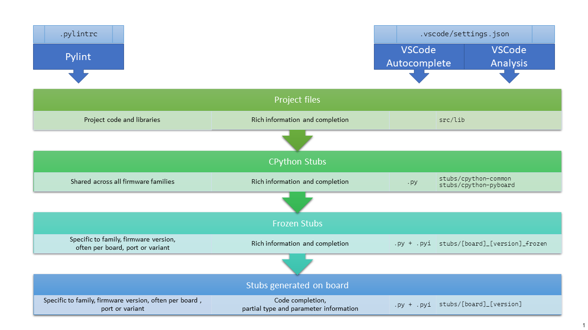

# micropython-stubs


This repo stores stubs generated by the [MicroPython-Stubber](https://github.com/Josverl/micropython-stubber) tool.
Currently over a 1.000 stubfiles of common MicroPython modules are available in this repo to help you write code quicker, and with less errors,  to aid in code completion, static type checking and overall development using MicroPython.


<!-- ALL-CONTRIBUTORS-BADGE:START - Do not remove or modify this section -->
[](#contributors-)
<!-- ALL-CONTRIBUTORS-BADGE:END -->


## List of current firmwares and stubs 
The list of the current included firmwares, ports and boards is listed on the [**Firmwares page**](firmwares.md)  

This includes stubs from the following micropython families: 
 - MicroPython
 - Loboris port (ESP32)
 - Pycopy
 - M5Stack
 - EV3 / Lego

## Using the stubs 

In order to use the stubs you need to do a few things:  
 1.  Download a copy of this repo , either via `git clone` or by download a zip file with it's contents
     - store this in a folder, for example 'next to' your software projects such as in `c:\develop\micropython-stubs`  
     this contains a `stubs` folder that contains all stubs

 2. Over time you may want to periodically update this folder using `git pull`

### For each project where you want to use the stubs (Manual configuration) :   
this is not as complex as it seems,

 1.  **Create a symlink folder to `c:\develop\micropython-stubs\stubs` inside your project**  
     This will allow you to reference the same stub files from multiple projects, and limit the space needed. This a recommendation, and things work equally well if you copy the `stubs` folder into your project.  
     For details on how to create a symlink, please see : [_Create a symbolic link_](###create-a-symbolic-link)

 2.  **Copy the [samples](doc/samples) folder to your project**  
 this contains the base files you need to improve syntax highlighting and linting.

 2.  **Select which stub folders you need to reference**  
     - The order will influence results. place the 'higher quality' folders first.
     - Use forward slashes `/` rather than backslashes, also on Windows.
     - for example for micropython 1.13 on an ESP32 select:
         1. "./src/lib",
         2. "all-stubs/cpython_patch",
         3. "all-stubs/mpy_1_13-nightly_frozen/esp32/GENERIC", 
         4. "all-stubs/esp32_1_13_0-103",

 3.  **Configure VSCode to use the selected stub folders**  
      This instructs VSCode to consider your libs folder and the stubs for static code evaluation.
      VSCode allows this configuration to be set on **_workspace_** or _user_ level. I prefer setting it per workspace as that allows different settings for different projects, but you could do either.
     - use the [`.VSCode/settings.json` sample file](docs/samples/.VSCode/settings.json) located in the sample folder
     - you can open this file in VSCode itself, or use the settings menu 
     - place the folders in the 3 sections. 
          - each section should contain the same folders. 
          - it can be on a single line or split across lines. 
          - make sure it is a valid json array 

          ```
          "python.autoComplete.extraPaths": [
               "./src/lib", "all-stubs/cpython_patch", 
               "all-stubs/mpy_1_13-nightly_frozen/esp32/GENERIC", "all-stubs/esp32_1_13_0-103",
          ],
          "python.autoComplete.typeshedPaths": [
               "./src/lib", "all-stubs/cpython_patch", 
               "all-stubs/mpy_1_13-nightly_frozen/esp32/GENERIC", "all-stubs/esp32_1_13_0-103",
          ],
          "python.analysis.typeshedPaths": [
               "./src/lib", "all-stubs/cpython_patch", 
               "all-stubs/mpy_1_13-nightly_frozen/esp32/GENERIC", "all-stubs/esp32_1_13_0-103",
          ]
          ```
 3.  **Configure pylint to use the selected stub folders**  
     This instructs pylint to insert the list of paths into `sys.path` before performing linting, thus allowing it to find the stubs and use them to better validate your code. 

     - use the [.pylintcr sample file](docs/sample/.pylintrc) located in the sample folder
     - edit the line that starts with `init-hook=`  
          ``` ini
          init-hook='import sys;sys.path[1:1] = ["src/lib", "folder1","folder2", "folder3",];'
          ```
     - replace the folders with your selection of stub folders. **In this case they MUST be on a single line**
     - the result should look like:
          ``` ini
          init-hook='import sys;sys.path[1:1] = ["src/lib", "all-stubs/cpython_patch","all-stubs/mpy_1_13-nightly_frozen/esp32/GENERIC", "all-stubs/esp32_1_13_0-103",];'
          ```
 4.  **Restart VSCode**  
     VSCode must be restated for the Python language engine and Pylint to read the updated configuration.
     you can use: 
     - the `Developer: Reload Window` command.
     - or stop / start the editor

## Order of the stub folders

The stubs are used by 3 components.

 1. **pylint**
 2. the VSCode Autocompletion service
 3. the VSCode Analysis server

These 3 tools work together to provide code completion/prediction, type checking and all the other good things.
For this the order in which these tools use  the stub folders is significant, and best results are when they use the same order. 

in most cases the best results are achieved by the below setup:  



 1. **Your own source files**, including any libraries you add to your project.
 This can be a single libs folder or multiple directories

 2. **The CPython common stubs**. These stubs are handcrafted to mimic MicroPython modules on a CPython system.
 there are only a limited number of these stubs. ALso for some modules this approach does not appear to work. (such as the `cg` and `sys` modules)

 3. **Firmware specific frozen stubs**. Most micropython firmwares include a number of python modules that have been included in the firmware as frozen modules in order to take up less memory.
 these modules have been extracted from the source code. where possible this is done per port and board,  or if not possible the common configuration for has been included.

 4. **Micropython-stubber Stubs**. For all other modules that are included on the board, [micropython-stubber](https://github.com/Josverl/micropython-stubber) or [micropy-cli](https://github.com/BradenM/micropy-cli) has been used to extract as much information as available, and provide that as stubs. While there is a lot of relevant and useful information for code completion, it does unfortunately not provide all details regarding parameters that the earlier  options may provide.


When using a different code editor, a similar configuration may be used. 

 _**Note:**_ While it is possible for you to configure different processing orders, this will probably lead to confusing or contradicting feedback in the code editor that you are using.

## Create a symbolic link
To create the symbolic link to the `micropython-stubs/stubs` folder the instructions differ slightly for each OS/
The below examples assume that the micropython-stubs repo is cloned 'next-to' your project folder.
please adjust as needed.

### Windows 10 
Requires `Developer enabled` or elevated powershell prompt.

``` powershell
# target must be an absolute path, resolve path is used to resolve the relative path to absolute
New-Item -ItemType SymbolicLink -Path "all-stubs" -Target (Resolve-Path -Path ../micropython-stubs/stubs)
```
or use [mklink](https://docs.microsoft.com/en-us/windows-server/administration/windows-commands/mklink) in an (elevated) command prompt
``` cmd
rem target must be an absolute path
mklink /d all-stubs c:\develop\micropython-stubs\stubs
```

### Linux/Macos/Unix

``` sh
# target must be an absolute path
ln -s /path/to/micropython-stubs/stubs all-stubs
```

## Contributors
Thanks to everyone that has submitted stubs or other relevant pieces of code and information, or published relevant stubs on pypi or github.

<!-- ALL-CONTRIBUTORS-LIST:START - Do not remove or modify this section -->
<!-- prettier-ignore-start -->
<!-- markdownlint-disable -->
<table>
  <tr>
    <td align="center"><a href="https://github.com/Josverl"><br /><sub><b>Jos Verlinde</b></sub></a><br /><a href="https://github.com/Josverl/micropython-stubs/commits?author=josverl" title="Code">💻</a> <a href="#stubs-josverl" title="MicroPython stubs">📝</a> <a href="#test-josverl" title="Test">✔</a> <a href="#tool-josverl" title="Tools">🔧</a></td>
    <td align="center"><a href="https://micropython.org/"><br /><sub><b>MicroPython</b></sub></a><br /><a href="#data-micropython" title="Data">🔣</a> <a href="#stubs-micropython" title="MicroPython stubs">📝</a></td>
    <td align="center"><a href="https://github.com/loboris"><br /><sub><b>Boris Lovosevic</b></sub></a><br /><a href="#data-loboris" title="Data">🔣</a> <a href="#stubs-loboris" title="MicroPython stubs">📝</a></td>
    <td align="center"><a href="https://github.com/pfalcon"><br /><sub><b>Paul Sokolovsky</b></sub></a><br /><a href="#data-pfalcon" title="Data">🔣</a> <a href="#stubs-pfalcon" title="MicroPython stubs">📝</a></td>
    <td align="center"><a href="https://github.com/pycopy"><br /><sub><b>pycopy</b></sub></a><br /><a href="#data-pycopy" title="Data">🔣</a> <a href="#stubs-pycopy" title="MicroPython stubs">📝</a></td>
    <td align="center"><a href="https://github.com/pycom"><br /><sub><b>Pycom</b></sub></a><br /><a href="#infra-pycom" title="Infrastructure (Hosting, Build-Tools, etc)">🚇</a></td>
    <td align="center"><a href="https://github.com/BradenM"><br /><sub><b>Braden Mars</b></sub></a><br /><a href="#stubs-BradenM" title="MicroPython stubs">📝</a> <a href="#test-BradenM" title="Test">✔</a> <a href="#tool-BradenM" title="Tools">🔧</a> <a href="#platform-BradenM" title="Packaging/porting to new platform">📦</a></td>
  </tr>
  <tr>
    <td align="center"><a href="https://github.com/pfalcon"><br /><sub><b>Paul Sokolovsky</b></sub></a><br /><a href="#stubs-pfalcon" title="MicroPython stubs">📝</a></td>
    <td align="center"><a href="https://github.com/dastultz"><br /><sub><b>Daryl Stultz</b></sub></a><br /><a href="#stubs-dastultz" title="MicroPython stubs">📝</a></td>
    <td align="center"><a href="http://patrickwalters.us/"><br /><sub><b>Patrick</b></sub></a><br /><a href="#test-askpatrickw" title="Test">✔</a> <a href="#stubs-askpatrickw" title="MicroPython stubs">📝</a></td>
  </tr>
</table>

<!-- markdownlint-restore -->
<!-- prettier-ignore-end -->

<!-- ALL-CONTRIBUTORS-LIST:END -->

I invite everyone that has generated stubs for a board or port not on the current list, or has another contribution, to submit the stubs via a pull request or by just zipping up your stubs and creating an issue. 

This project follows the [all-contributors](https://github.com/all-contributors/all-contributors) specification. 
