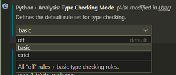
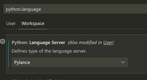

# VSCode and Pylance

VSCode  uses Pylance, and optionally a linter such as pylint or mypy.

## Install the stubs from PyPi.

`pip install -U micropython-<port>-stubs` 
For details see [Using stubs](20_using.md)

## Configure VSCode & Pylance.

VSCode allows the configuration to be set on **_workspace_** , folder or _user_ level. I prefer setting it per workspace or folder as that allows different settings for different projects, but you could do either.

### Install the Python and Pylance extensions.
 1.  Install the [Python extension](https://marketplace.visualstudio.com/items?itemName=ms-python.python) from the marketplace. [Pylance](https://marketplace.visualstudio.com/items?itemName=ms-python.vscode-pylance) will be installed as an optional extension.
 2. By default the Pylance checking is sset to `Off` and the language server is set to `Default`
    I recommend you set the language server to `Pylance` and the checking to `basic` ( or `strict` ) 
    
 3.  Open a Python (.py) file and the Pylance extension will activate.


### Select the correct Python environment.
If you have created a `venv` make sure to also select it in VSCode using 
`F1, >Python: select interpreter` or the UX 


### Set Pylance as the language Server. 
Note: If you've previously set a language server and want to try Pylance, make sure you've set `"python.languageServer": "Default" or "Pylance"` in your settings.json file using the text editor, or using the Settings Editor UI.


Example from `.vscode/settings.json`
```json
{
    "python.languageServer": "Pylance",
    "python.analysis.typeCheckingMode": "basic",
} 
```

## Add configuration to suppress unneeded warnings.

After installing the stubs you may see some warnings that the source code to referenced modules is not found. 

``` log
Import "machine" could not be resolved from source
Import "time" could not be resolved from source
Import "urequests" could not be resolved from source
```
This is because the packages do not include the source code, as it are stub-only packages. 

To supress these warnings add the following to youryour VSCode configuration.

`.vscode/settings.json`
```json
    "python.analysis.diagnosticSeverityOverrides": {
        "reportMissingModuleSource": "none"
    },

```

## Configure Pylance to read MicroPython stdlib stubs.

Pylance and Pyright do not by default allow you to override the stdlib stubs.
This is possible but needs to be configured explicitly in the settings.

the VSCode configuration for this is shown below.

`.vscode/settings.json`
```json
{
    "python.analysis.typeshedPaths": [
        ".venv/Lib/site-packages",
        "typings"
    ],
}
```

The diagram below shows the sequence of checks that Pylance/Pyright does to resolve the stubs for a module.
with the above configuration it will first check the `venv` or the `typings` folder and then look for the stdlib stubs in these folders.
Without the configuration it will only look for the stdlib stubs in the typeshed stubs that are shipped with Pyright.

``` {mermaid}
sequenceDiagram
    participant P as Pylance/Pyright
    participant Source as Source code
    participant venv as micropython.pyi stubs in typings or venv
    participant stdlib as micropython stdlib .pyi stubs in typings/stdlib or venv/.../stdlib
    participant typeshed as typeshed stdlib stubs
    autonumber

    note right of P: lookup micropython module
    P --x Source: check 
    
        rect rgba(0, 0, 255, .3)
            P ->>+ venv: check
            venv -->>- P: resolved MicroPython stubs
        end
    opt recommended configuration
        rect rgba(0, 128, 128, .3)
            note over P,stdlib: requires { "python.analysis.typeshedPaths": ["typings",".venv/Lib/site-packages"] }
            P ->>+ stdlib: check
            stdlib -->>-P: resolved MicroPython stdlib stubs
        end
    end
    rect rgba(128, 28, 128, .3)
        %% note over P,typeshed: requires configuration of path
        P ->>+ typeshed: check
        typeshed -->>-P: resolved stdlib stubs
    end
```


## Sample VSCode configuration file.

The below configuration combines the above settings.
 * Enable Pylance and set basic checking
 * Suppress warnings about missing source code
 * Configure Pylance to read MicroPython stdlib stubs

`.vscode/settings.json`
```json
{
    "python.languageServer": "Pylance",
    "python.analysis.typeCheckingMode": "basic",
    "python.analysis.diagnosticSeverityOverrides": {
        "reportMissingModuleSource": "none"
    },
    "python.analysis.typeshedPaths": [
        ".venv/Lib/site-packages"
    ],
    "python.linting.enabled": true,
    "python.linting.pylintEnabled": true,
}
```

[Pylance]: https://marketplace.visualstudio.com/items?itemName=ms-python.vscode-pylance

