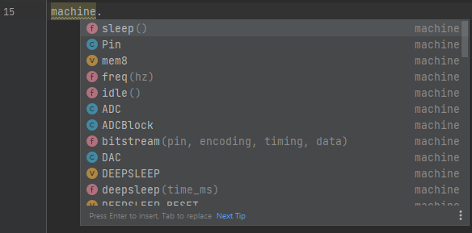
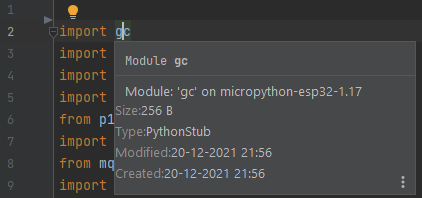
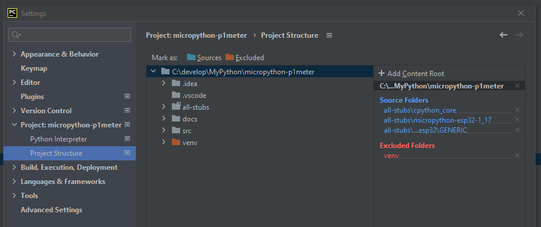

# PyCharm

## Configure PyCharm to use the selected stub folders  

PyCharm supports Python stub files, so the simples option is to install the micropython-stubs from PyPi.  
  
ref: https://www.jetbrains.com/help/pycharm/type-hinting-in-product.html#stub-type-hints


## Install the stubs from PyPi.

Install the stubs as documented in [using the thubs](20_using.md)

Example: `pip install -U micropython-stm32-stubs==1.19.1.*`

If you have a requirements.txt file you can add the stubs to it, and PyCharm will offer to install them automatically.

```text
micropython-stm32-stubs==1.19.1.*
```	

After this Pycharm will use the stubs to validate your code and provide hints.

Note that Pycharm's rendering of the docstrings is limited, but still quite useful.

## Check library imports
To check if the correct types are used for your imports you can 'hover' the mouse over the module of an import statement. 
Pycharm will show the module's docstring that will allow you to identify which stub is being used.




### Disable Pycharm warnings for RP2 PIO code

As the RP2 PIO code is not valid python code, PyCharm will show muliple warning for the code.
To disable these warnings, add the following line to the top of the file or to the top of the function:

`# noinspection PyStatementEffect,PyArgumentList`

This will suppress the PyCharm warnings for that specific function

Complete sample: 
```python	
# noinspection PyStatementEffect,PyArgumentList
@rp2.asm_pio(set_init=rp2.PIO.OUT_LOW)
def blink_1hz():
    # Cycles: 1 + 7 + 32 * (30 + 1) = 1000
    set(pins, 1)
    set(x, 31)[6]
    label("delay_high")
    nop()[29]
    jmp(x_dec, "delay_high")

    # Cycles: 1 + 7 + 32 * (30 + 1) = 1000
    set(pins, 0)
    set(x, 31)[6]
    label("delay_low")
    nop()[29]
    jmp(x_dec, "delay_low")
```

## Legacy configuration: Clone the stubs repo 
Note that this is an older method of installation, and generally should not be used unless you have a specific need for stubs not (yet) published, and that cannot be installed from GitHub 

To use stubs from the micropython-stubs repository , follow these steps:

Copy some or all the stubs into a directory in your project, or use a symlink to a clone of the stubs.

- Mark the relevant directories as a source root by choosing **Mark Directory as | Sources Root** from the context menu of the directory.  
For example: 

  - all-stubs/cpython_core-pycopy
  - all-stubs/micropython-v1_17-frozen/esp32/GENERIC
  - all-stubs/micropython-v1_17-esp32

You should now be able to use code completion and typechecking for your micropython code in PyCharm

### Verify the paths 
You can verify the paths used in your project by 

File > Settings > Project Settings 
> Project Structure 

This should list the selected folders with stubs as Source Folders  



