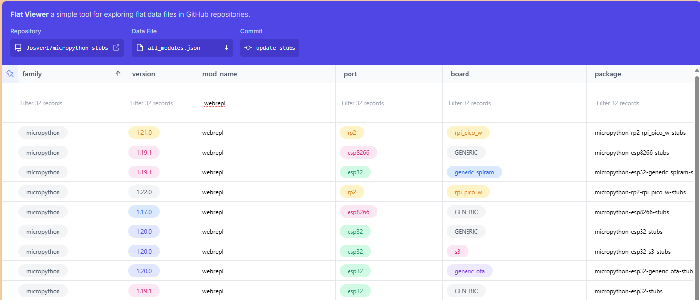

# List of available packages 

## Packages on PyPi

Overview of the published ports and boards.

Stm32 
 -  

 ESP32
 - 
 - 

 ESP8266
 - 

 RP2 / RP2040
 - 
 -  | 
 -  |  

SAMD
 - 

WEBASSEMBLY
 - 

**Notes:** 
 - PyPi transforms all names of the ports and boards to small-caps and kebab-case, (not snake_case).
 - Not all possible ports/boards are published as I do not have access to hardware to create board-stubs for all ports and boards.
 - Newly published stubs may show as 'not found', please [check PyPi directly](https://pypi.org/search/?q=micropython+-stubs&o=&c=Programming+Language+%3A%3A+Python+%3A%3A+Implementation+%3A%3A+MicroPython)

# Overview of all modules of all published stubs 

There is a simple way to discover if stubs for a specific module have been published 
via the [Flat Viewer](https://githubnext.com/projects/flat-data) website.
This offers a searchable and exportable view of the all_modules.json file that is automatically updated when new stubs are published.

Click on the image to search the list of all modules that are currently available as stubs.

*Note:* _This list does not precicely reflect which modules are avaialbe on what firmware as a few modules are omitted from the ditribution packages to avoid conflicts with CPython._

TODO: 
 - currently not yet automatically updated
 - add links to PyPi 

## Packages on GitHub

 - list of (latest) packages that can be installed from GitHub
 - add commands to install 
TODO: 
 - currently not yet automatically updated

## List of current firmwares and stubs 

This includes stubs from the following MicroPython families: 
 - [MicroPython](micropython-stubs)
 - [Pycopy](pycopy-stubs)
 - M5Stack
 - EV3/Lego
 - Loboris port (ESP32) - Available but no longer maintained

 and Micropython Modules: 
 - All frozen MicroPython modules
 - the [LVGL GUI libraries](https://github.com/lvgl/lv_binding_micropython)
 - [ulab native modules](ulab-stubs)

An up-to-date list of all current Firmwares, ports and boards is listed on the [**Firmwares page**](all-stubs) 

