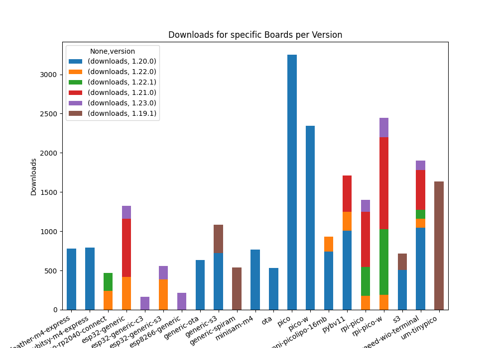

Some Download Statistics

The following graph shows the number of downloads of the stubs from PyPi over time.
I'm not sure what causes the spikes in downloads, but it is interesting to see that the number of downloads is increasing over time, and some of the spikes have correlation to the publication of new MicroPython versions.

|  |  |
| ------------------------------ | --------------------------------- |
|    |  |

In addition some tools such as [the MicroPico VSCode extension](https://marketplace.visualstudio.com/items?itemName=paulober.pico-w-go) bundle a version of the stubs with their distribution, so the actual usage is higher than the number of downloads.

