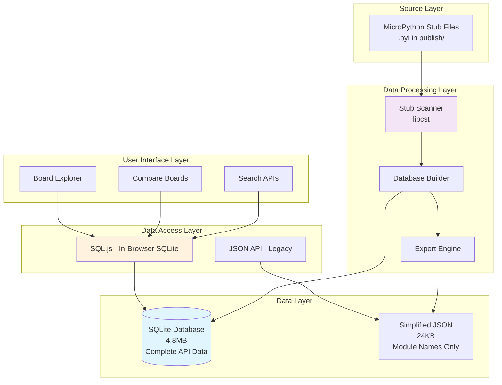
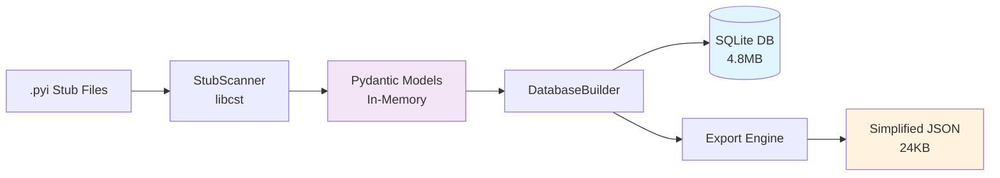
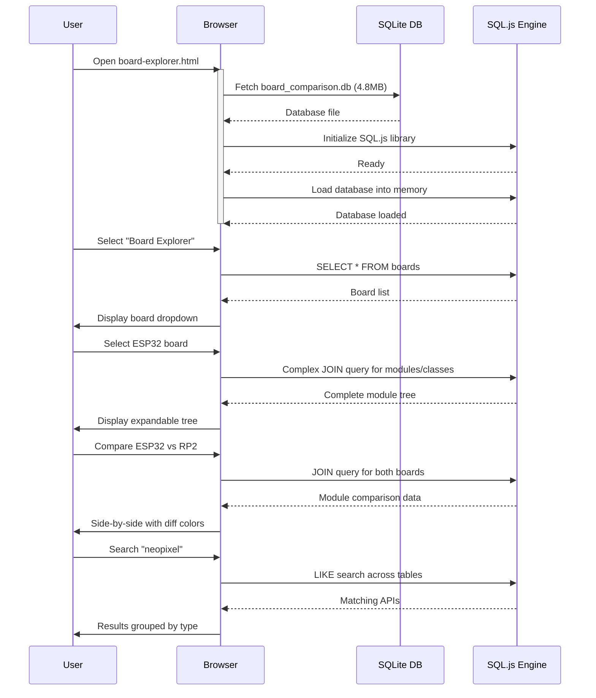
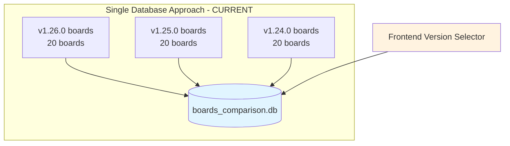
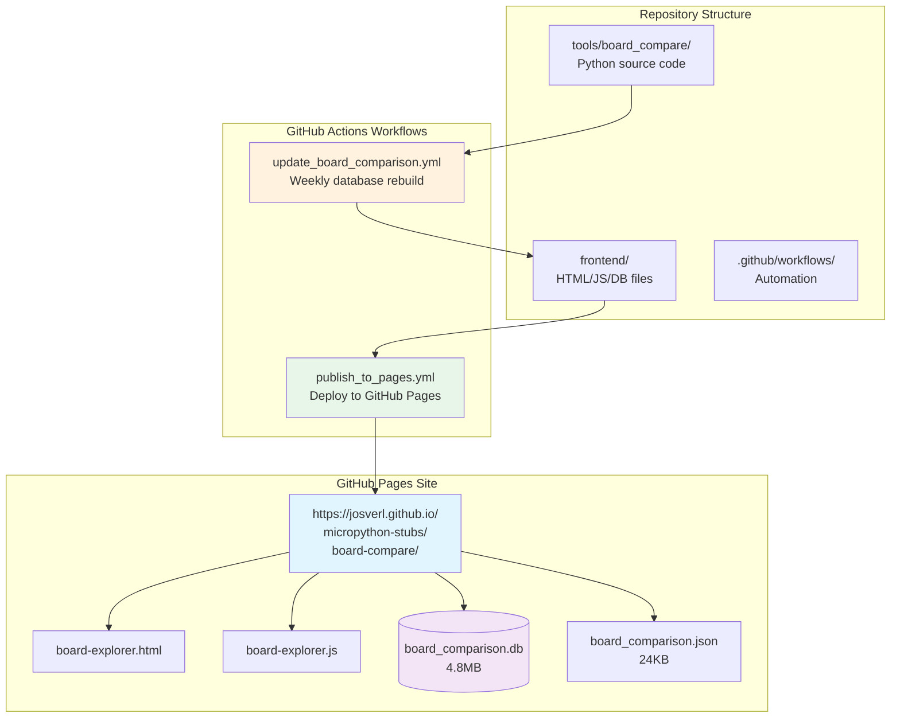

# Board Comparison Tool - Architecture and Design Decisions

## Overview

The MicroPython Board Comparison Tool is designed to help developers understand API differences across various MicroPython boards and versions. This document outlines the architectural decisions, design patterns, and rationale behind key implementation choices.

## System Architecture

### High-Level Architecture



## Key Design Decisions

### 1. Parser Selection: libcst for Stub Parsing

**Decision:** Use `libcst` for parsing MicroPython stub files

**Rationale:**
- **Alignment with micropython-stubber**: The main stub generation tool uses libcst, ensuring consistency across the project
- **Future extensibility**: libcst preserves formatting and comments, enabling future enhancements like:
  - Comment preservation for documentation
  - Layout analysis for code organization insights
  - Formatting-aware diff generation
- **CST vs AST**: Concrete Syntax Tree (CST) provides richer information than Abstract Syntax Tree (AST)
- **Risk mitigation**: Using the same parser as the stub generator reduces compatibility issues
- **Community alignment**: Maintains consistency with the broader MicroPython stubber ecosystem

**Trade-offs:**
- **External dependency**: Requires `libcst` package (added to requirements)
- **Performance**: Pure Python implementation is slightly slower than native AST
- **Complexity**: More complex API than stdlib ast module

**Implementation Notes:**
- libcst is already a dependency of micropython-stubber
- The performance difference is negligible for this use case (< 1 second for 67 modules)
- Simplified helper methods handle libcst's more verbose node structure

### 2. Database Schema Design

**Decision:** Normalized relational schema with many-to-many relationships and multi-version support

**Rationale:**
- **Space efficiency**: Modules/classes shared across boards stored once
- **Query performance**: Indexed relationships enable fast cross-board queries
- **Data integrity**: Foreign key constraints prevent orphaned records
- **Multi-version support**: Single database can store multiple MicroPython versions
- **Scalability**: Can support 100+ boards and multiple versions without duplication

**Schema Highlights:**
```sql
-- Boards uniquely identified by (version, port, board)
boards (id, version TEXT, port TEXT, board TEXT, mpy_version, arch)
  UNIQUE(version, port, board)

-- Shared module definitions (deduplicated across versions)
modules (id, name TEXT UNIQUE, docstring TEXT)

-- Many-to-many: which boards have which modules
board_modules (board_id, module_id)
  PRIMARY KEY (board_id, module_id)

-- Classes within modules
classes (id, module_id, name, docstring)
  UNIQUE(module_id, name)

-- Methods/functions
methods (id, module_id, class_id, name, return_type, ...)

-- Parameters
parameters (id, method_id, name, type_hint, position, ...)
```

**Multi-Version Design:**
- The `version` field in boards table enables storing v1.26.0, v1.25.0, etc. in one database
- Boards are uniquely identified by the composite key (version, port, board)
- Modules are shared across versions where identical (deduplication)
- Frontend can filter by version using SQL queries: `WHERE version = 'v1.26.0'`

**Trade-offs:**
- More complex queries than flat structure (requires joins)
- Requires join operations for data retrieval
- Benefits far outweigh costs: 4.8MB for 20 boards vs ~50MB+ for flat structure

### 3. Database-Only Frontend Strategy

**Decision:** Frontend uses SQLite database exclusively via SQL.js; simplified JSON kept only for legacy viewers

**Rationale:**
- **Single source of truth**: Database contains complete API information (classes, methods, parameters)
- **No synchronization issues**: No need to keep JSON and database in sync
- **Rich queries**: SQL enables powerful filtering, searching, and comparison
- **Complete functionality**: All features (explorer, compare, search) work from database
- **Bandwidth efficiency**: 4.8MB database download vs 168MB detailed JSON

**Implementation:**
- Enhanced viewer (`board-explorer.html`) uses database exclusively
- Simplified JSON (24KB) still generated for backward compatibility with simple viewers
- SQL.js library (500KB) loaded from CDN for in-browser database queries
- Database queries execute client-side, no backend required

**Implementation:**
- `export_to_json()`: Module names only (24KB)
- `export_detailed_to_json()`: Full API data (168MB) - optional
- In-browser: SQL.js queries 4.8MB database on-demand

### 4. Frontend Architecture: Multi-View SPA

**Decision:** Single-page application with three distinct views

**Rationale:**
- **Separation of concerns**: Each view has a specific purpose
- **Better UX**: No page reloads, smooth transitions
- **Code organization**: Modular JavaScript functions
- **State management**: Simple global state for selected boards

**Views:**
1. **Board Explorer**: Single board inspection
2. **Compare Boards**: Side-by-side comparison with diff mode
3. **Search APIs**: Cross-board feature discovery

### 5. SQL.js for In-Browser Queries

**Decision:** Use SQL.js to query SQLite database directly in browser

**Rationale:**
- **No backend required**: True static site hosting
- **Powerful queries**: Full SQL support for complex comparisons
- **Efficient**: Only loads 4.8MB database, not 168MB JSON
- **Familiar**: Standard SQL syntax for queries
- **Graceful degradation**: Falls back to JSON if unavailable

**Trade-offs:**
- ~500KB SQL.js library overhead
- WebAssembly requirement (modern browsers only)
- Initial database load time (~1-2 seconds)

### 6. Pydantic Models for Type Safety

**Decision:** Use Pydantic models for all data structures

**Rationale:**
- **Type validation**: Catch errors early in data processing
- **Self-documenting**: Models serve as documentation
- **IDE support**: Better autocomplete and type checking
- **Serialization**: Easy conversion to/from dictionaries and JSON
- **Consistency**: Same models used throughout the pipeline

**Models:**
```python
Parameter → Method → Class → Module → Board
```

### 7. Color-Coded Diff Visualization

**Decision:** Use color coding (green/red/yellow) for differences

**Rationale:**
- **Quick visual scanning**: Colors draw attention to differences
- **Intuitive**: Green=unique to left, Red=unique to right
- **Accessible**: Combined with text labels ([UNIQUE])
- **Standard convention**: Similar to git diff output

### 8. Expandable Tree View

**Decision:** Hierarchical tree structure for board explorer

**Rationale:**
- **Natural hierarchy**: Modules → Classes → Methods
- **Progressive disclosure**: Show details on-demand
- **Performance**: Don't render everything upfront
- **Familiar UX**: Similar to file explorers

## Data Flow

### 1. Database Building Flow



### 2. Frontend Data Flow



## Performance Considerations

### 1. Database Size Optimization

**Techniques:**
- Normalized schema (no duplication)
- Integer IDs instead of strings
- Indexed foreign keys
- Minimal docstring storage

**Results:**
- 20 boards, 12,144 methods = 4.8MB database
- ~240 bytes per method (including all relationships)

### 2. Frontend Loading Strategy

**Approach:**
- **Phase 1**: Load 24KB JSON (instant)
- **Phase 2**: Load SQL.js library (~500KB) in background
- **Phase 3**: Load database (4.8MB) on first interaction
- **Phase 4**: Query on-demand as user navigates

**Benefits:**
- Time to interactive: < 1 second
- Total data transfer: 5.3MB (vs 168MB for detailed JSON)
- Perceived performance: Excellent

### 3. Query Optimization

**Strategies:**
- Indexed foreign keys on all relationships
- Prepared statements for repeated queries
- Limit result sets with WHERE clauses
- Select only needed columns

## Scalability Considerations

### 1. Multiple Versions Support

**Current Implementation:**
- Database schema supports multiple versions in a single database
- Boards table has composite unique key: (version, port, board)
- Version field enables: `SELECT * FROM boards WHERE version = 'v1.26.0'`
- Currently populated with v1.26.0 only

**Scaling to Multiple Versions:**



**Benefits of Single Database:**
- Module deduplication across versions (significant space savings)
- Cross-version comparisons possible: "Compare ESP32 v1.26.0 vs v1.25.0"
- Simpler deployment (one file to manage)
- Efficient queries with WHERE version = clause

**Alternative: Multiple Databases (Future Option):**
- One database per version (board_comparison_v1_26_0.db, etc.)
- Cleaner separation, easier to update individual versions
- Trade-off: More files to manage, no cross-version queries

### 2. Growing Board Count

**Current:** 20 boards for v1.26.0
**Scalability Projection:**

| Boards | Modules | Classes | Methods | DB Size | Query Time |
|--------|---------|---------|---------|---------|------------|
| 20     | 128     | 173     | 12,144  | 4.8MB   | < 50ms     |
| 50     | 200     | 350     | 30,000  | ~12MB   | < 100ms    |
| 100    | 300     | 600     | 60,000  | ~24MB   | < 200ms    |

**Scalability Features:**
- Linear growth in database size
- Normalized schema prevents duplication (shared modules across boards)
- Indexed foreign keys maintain fast query performance
- Can efficiently handle 100+ boards in single database

### 3. API Complexity Growth

**Challenge:** More classes/methods over time
**Mitigation:**
- Pagination for large result sets
- Virtual scrolling for long lists
- Lazy loading of method details

## Testing Strategy

### 1. Unit Tests

**Coverage:**
- Pydantic models validation
- AST parsing edge cases
- Database operations (CRUD)
- JSON export/import

### 2. Integration Tests

**Coverage:**
- End-to-end stub scanning
- Database building from stubs
- Export → Import round-trip
- SQL query correctness

### 3. Frontend Tests

**Approach:**
- Manual testing (no automated UI tests yet)
- Test with different browsers
- Test with/without SQL.js
- Test edge cases (empty results, errors)

## Security Considerations

### 1. Input Validation

**Measures:**
- Pydantic models validate all input data
- SQL parameterized queries (prevent injection)
- JSON schema validation
- Error handling for malformed files

### 2. Client-Side Security

**Measures:**
- No eval() or similar dynamic code execution
- CSP-friendly code (no inline scripts in production)
- XSS prevention (proper HTML escaping)
- HTTPS recommended for GitHub Pages

### 3. Data Integrity

**Measures:**
- Foreign key constraints in database
- Transaction-based database operations
- Atomic file writes
- Backup before updates

## Deployment Architecture

### GitHub Pages Hosting



**Deployment Structure:**
```
Repository
├── tools/board_compare/              # Source code (not deployed)
│   ├── *.py                          # Python tools
│   ├── frontend/                     # Files for deployment
│   │   ├── board-explorer.html       # Main viewer (deployed)
│   │   ├── board-explorer.js         # App logic (deployed)
│   │   ├── board_comparison.db       # SQLite database (deployed, 4.8MB)
│   │   └── board_comparison.json     # Simplified JSON (deployed, 24KB)
│   └── tests/                        # Test files
└── .github/workflows/
    ├── update_board_comparison.yml   # Weekly rebuild workflow
    └── publish_to_pages.yml          # GitHub Pages deployment workflow
```

**GitHub Actions Workflows:**

1. **update_board_comparison.yml** (Weekly Rebuild)
   - Triggers: Every Sunday at 2 AM UTC, or manual dispatch
   - Actions:
     - Scans latest published stubs for v1.26.0
     - Builds SQLite database
     - Exports simplified JSON
     - Commits updated files to repository
   - Output: Updated board_comparison.db and board_comparison.json

2. **publish_to_pages.yml** (Deploy to GitHub Pages)
   - Triggers: On push to main branch, or manual dispatch
   - Actions:
     - Copies frontend/ contents to GitHub Pages directory
     - Deploys to GitHub Pages
     - Enables HTTPS and CDN caching
   - Output: Live site at https://josverl.github.io/micropython-stubs/board-compare/

**Deployment Benefits:**
- **Free hosting**: GitHub Pages at no cost
- **HTTPS by default**: Secure connections
- **Global CDN**: Fast loading worldwide
- **Version control**: All changes tracked in git
- **Automated updates**: Weekly database refresh
- **Zero configuration**: No server setup required

## Error Handling Strategy

### 1. Graceful Degradation

**Levels:**
1. Full functionality (SQL.js + database)
2. Basic comparison (JSON only)
3. Error message (if JSON fails to load)

### 2. User-Friendly Errors

**Approach:**
- Catch all exceptions
- Display clear error messages
- Provide fallback options
- Log to console for debugging

## Maintenance Considerations

### 1. Weekly Updates

**Automation:**
- GitHub Actions workflow
- Runs every Sunday at 2 AM UTC
- Scans latest published stubs
- Rebuilds database
- Commits updated JSON/DB

### 2. Dependency Management

**Strategy:**
- Minimal dependencies (only Pydantic)
- Pin dependency versions
- Test updates before deployment
- Document breaking changes

## Future Enhancements

### Planned Improvements

#### 1. Shareable Comparison Links (High Priority)

**Feature:** URL parameters for direct deep-linking to comparisons

**Implementation:**
```javascript
// URL format:
// ?board1=esp32-esp32_generic&board2=rp2-rpi_pico&view=compare&diff=true

// On page load:
const params = new URLSearchParams(window.location.search);
if (params.has('board1') && params.has('board2')) {
    loadComparison(params.get('board1'), params.get('board2'));
    if (params.get('diff') === 'true') {
        hideCommonModules(true);
    }
}

// On comparison:
function updateURL(board1, board2, diffMode) {
    const url = new URL(window.location);
    url.searchParams.set('board1', board1);
    url.searchParams.set('board2', board2);
    url.searchParams.set('view', 'compare');
    url.searchParams.set('diff', diffMode);
    window.history.pushState({}, '', url);
}
```

**Benefits:**
- Share specific comparisons via URL
- Bookmark favorite comparisons
- Link from documentation or issues
- Enable back/forward browser navigation

**Examples:**
- `?board1=esp32-esp32_generic&board2=rp2-rpi_pico&view=compare&diff=true`
- `?search=neopixel&view=search`
- `?board=esp32-esp32_generic&view=explorer&module=machine`

#### 2. Visual Diff for Method Signatures

**Feature:** Side-by-side parameter comparison with highlighting

- Highlight changed parameter types
- Show added/removed parameters
- Compare default values

#### 3. Export Comparison Reports

**Formats:**
- PDF export with formatting
- CSV export for spreadsheet analysis
- Markdown export for documentation
- Shareable comparison links (see #1)

#### 4. Advanced Filtering

**Categories:**
- By module type (stdlib, hardware, network, filesystem)
- By API pattern (sync, async, properties, context managers)
- By decorator (@property, @classmethod, @staticmethod)
- By parameter count (simple vs complex APIs)

#### 5. Historical Comparisons (Requires Multi-Version)

**Features:**
- Compare same board across versions (ESP32 v1.26.0 vs v1.25.0)
- Track API evolution over time
- Identify breaking changes
- Visualize API growth

**Implementation:**
- Populate database with multiple versions
- Add version selector to UI
- Cross-version comparison queries

#### 6. Offline Support

**PWA Features:**
- Service worker for caching
- Offline-first architecture
- Install as native app
- Background sync for updates

## Lessons Learned

### What Worked Well

1. **libcst for parsing**: Alignment with micropython-stubber, enables future enhancements
2. **Normalized database**: Efficient storage and queries (4.8MB for 20 boards)
3. **Database-only frontend**: Single source of truth, eliminated sync issues
4. **SQL.js integration**: Powerful queries without backend, true static site
5. **Color-coded diff**: Intuitive visual comparison with green/red highlighting
6. **Multi-version schema**: Forward-thinking design supports multiple versions

### What Could Be Improved

1. **Initial design considerations:**
   - First attempt used Python AST → switched to libcst for consistency
   - Initial 168MB detailed JSON → eliminated in favor of database-only
   - JSON + DB dual system → simplified to database-only after user feedback

2. **Testing gaps:**
   - No automated UI tests (manual testing is time-consuming)
   - Could benefit from end-to-end tests with real browser
   - Performance testing with larger datasets needed

3. **Documentation evolution:**
   - Initial docs lacked architecture rationale → added comprehensive ARCHITECTURE.md
   - Missing test coverage docs → added TESTING.md
   - Deployment process unclear → added DEPLOYMENT.md
3. **SQL.js CDN dependency**: Blocked in some environments
4. **Limited offline support**: Requires internet for first load

## Conclusion

The Board Comparison Tool architecture balances several competing concerns:

- **Performance**: Fast initial loads with on-demand detail loading
- **Functionality**: Rich comparison features with powerful search
- **Simplicity**: No backend required, pure static hosting
- **Maintainability**: Automated updates, minimal dependencies
- **Usability**: Intuitive UI with multiple specialized views

The design is flexible enough to accommodate future enhancements while remaining simple and maintainable in its current form.
