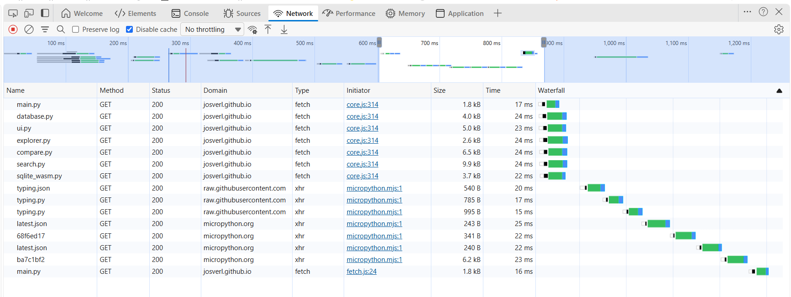

## Webassembly Findings


### pyscript downlo


### Mip downloads packages sequentially

It appears the micropython package install is done sequentially rather than in parallel.
I think mip for webassembly could at least download the files for the different packages in parallel
while keeping the installation process itself sequential.


```toml
name = "MicroPython stubs explorer"

packages = [
    "github:josverl/micropython-stubs/mip/typing.json",
    "logging",
    ]

[files]
"main.py" = ""
"database.py" = ""
"ui.py" = ""
"explorer.py" = ""
"compare.py" = ""
"search.py" = ""
"sqlite_wasm.py" = ""

```

```html
    <!-- Main Python script -->
    <script type="mpy" src="./main.py" config="./pyscript.toml"></script>

```





## Compare view is showing additional classes in the board1 treeview
The classes ( on possibly others) in the left treeview seem to duplicated from the right treeview - but somehow mixed in.

This shows up when comparing the stubs for the network module between the PICO_W and esp32 boards,
as they have different implementations of the network module.


### mpy-click events do not appear to accept custom parameters to pass information
which makes it cumbersome to replace inline javascript event handlers that pass parameters.

## Click Handler Implementation Comparison

### Original Implementation: Inline `onclick` with Function Calls

**Pattern:**
```html
<!-- Navigation tabs -->
<button onclick="switch_page('explorer')">Stubs Explorer</button>
<button onclick="switch_page('compare')">Compare Board-stubs</button>

<!-- Module/class toggles (dynamic) -->
<div onclick="toggle_tree_node('module-id-123', event)">
    <span>machine</span>
</div>
```

**Pros:**
- ✅ **Simple and Direct:** Function calls with arguments are straightforward JavaScript
- ✅ **Flexible Parameter Passing:** Can pass any JavaScript expression as arguments: `onclick="fn('id', event, true)"`
- ✅ **Familiar Pattern:** Standard HTML/JavaScript approach, well-documented
- ✅ **No Data Attribute Overhead:** Arguments passed directly in the onclick expression
- ✅ **Event Object Access:** `event` can be passed explicitly when needed

**Cons:**
- ❌ **Inline JavaScript Anti-Pattern:** Violates modern web development best practices and CSP policies
- ❌ **Not Idiomatic for PyScript:** Mixes JavaScript execution context with Python runtime
- ❌ **Hard to Test:** Requires executing JavaScript to verify behavior
- ❌ **Template String Escaping:** Risk of injection when building onclick strings: `f"onclick=\"toggle('{id}')\""`
- ❌ **No Framework Integration:** Bypasses PyScript's event binding system
- ❌ **Maintainability:** Scattered imperative code instead of declarative attributes

---

### Current Implementation: `mpy-click` with Data Attributes

**Pattern:**
```html
<!-- Navigation tabs -->
<button mpy-click="go_explorer">Stubs Explorer</button>
<button mpy-click="go_compare">Compare Board-stubs</button>

<!-- Module/class toggles (dynamic) -->
<div mpy-click="toggle_tree_node" data-module-target="module-id-123">
    <span>machine</span>
</div>
```

**Python handler:**
```python
def toggle_tree_node(event):
    target = event.target
    element_id = getattr(target.dataset, 'moduleTarget', None) or \
                 getattr(target.dataset, 'classTarget', None)
    if element_id:
        elem = document.getElementById(element_id)
        elem.classList.toggle("hidden")
```

but as the data cannot be passed in the event that must instead be located on the event target element(s) itself.
which requires them to be set while generating.
It also does not allow for passing a dynamic variables 

```py
    # Additional templating code
            elif key.endswith("-target") and value:
                # Set data attribute for element ID reference (used by toggle functions)
                target.setAttribute(f"data-{key}", value)
    # and 
    if module_element:
        populate_template(
            module_element,
            {
                "module-header-class": module_header_class,
                "module-click": "toggle_tree_node",
                "module-target": module_tree_id,  # Element ID to toggle  # <--- New addition
                "module-data": module["name"],
                "module-name": module["name"],
                "module-badge-style": "inline" if module_badge else "hide",
                "module-details": module_summary,
                "module-board-version": board_version_label,
                "module-id": module_tree_id,
            },
        ) 
    # and 
    if class_element:
        populate_template(
            class_element,
            {
                "class-click": "toggle_tree_node",
                "class-target": class_id,  # Element ID to toggle # <---- New addition
                "class-signature": f"class {cls['name']}",
                "base-classes": base_classes_span,
                "class-summary": class_summary,
                "class-id": class_id,
            },
        )

```
**Pros:**
- ✅ **Declarative and Clean:** Separates behavior (mpy-click) from data (data-* attributes)
- ✅ **PyScript Native:** Integrates with PyScript's MicroPython runtime event system
- ✅ **CSP Compliant:** No inline JavaScript execution, safer for security policies
- ✅ **Template-Friendly:** Easy to set via `populate_template()` without escaping concerns
- ✅ **Testable:** Can assert attribute presence without executing handlers
- ✅ **Modern Web Standards:** Follows HTML5 data attribute conventions
- ✅ **Framework Idiomatic:** Aligns with project's "MicroPython-first" architecture goal

**Cons:**
- ❌ **PyScript Limitation:** Cannot pass arguments in mpy-click attribute (`mpy-click="fn('arg')"` fails)
- ❌ **Verbose for Parameters:** Requires separate data attributes for each parameter
- ❌ **Dataset API Learning Curve:** Developers must understand JS proxy → Python attribute mapping (`data-module-target` → `dataset.moduleTarget`)
- ❌ **Extra HTML Attributes:** More verbose HTML with multiple data-* attributes
- ❌ **Indirection:** Handler must read from event.target.dataset instead of receiving arguments
- ❌ **getattr() Workaround:** Need to use `getattr(dataset, 'key', None)` because dataset is a JS proxy (not a Python dict)

---> 

